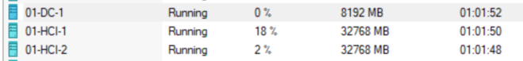
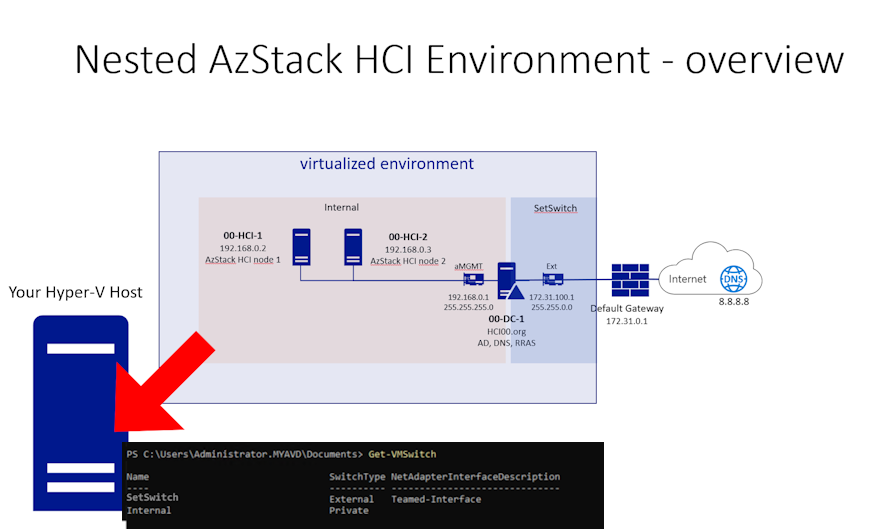
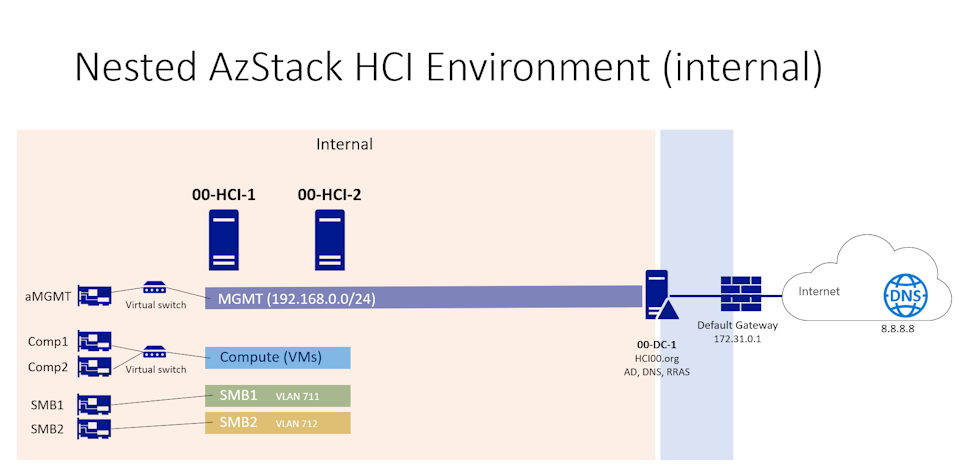
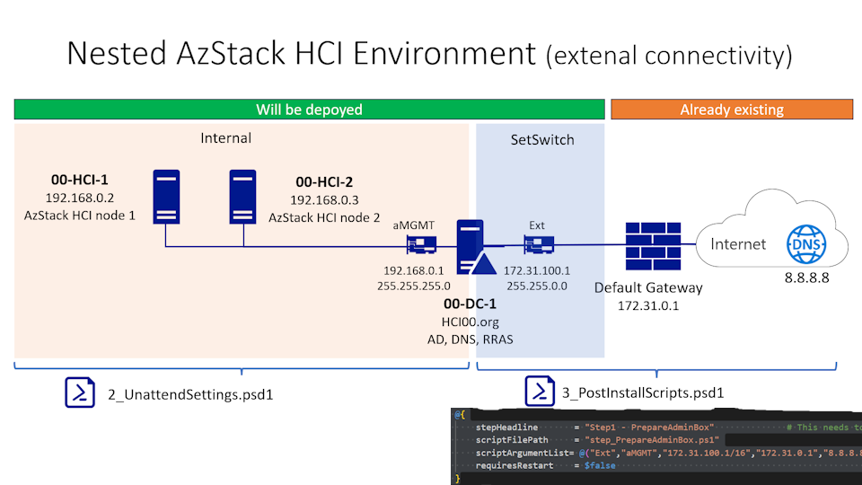
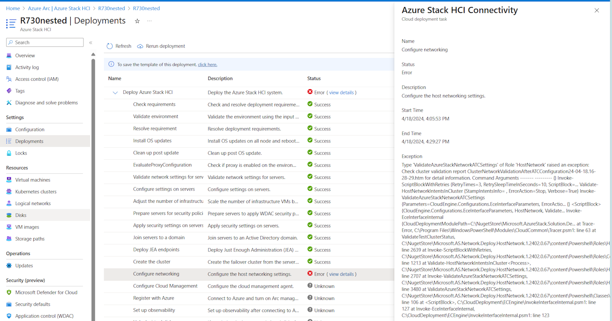
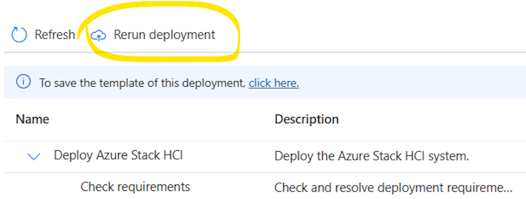

# Use CreateVmsUsingScript To Deploy A Nested Virtualization Environment To Test Azure Stack HCI 23H2

## This setup will create...  
- A Domain Controller with based on a sypreppe'd Windows 2022 vhdx you provide.
- 2 empty HCI nodes (with a sypreppe'd AzStack HCI 23H2 vhdx you provide) - ready to be deployed to Azure Stack HCI using the Azure portal.  


The deployment will create some VMs on your Hyper-V system:  


Once the deployment of HCI is done you will have something like this:  


## Watch It On YT  
[](https://youtu.be/_8QimlTNQpI)  

## Summary Of Steps:  
### 1. Provide 2 golden images as vhdx (Win Server 2022 with GUI, AzStack HCI 23H2 vanilla) both from .iso file using e.g. [CreateVhdxFromIso.ps1](./CreateVhdxFromIso.ps1)
### 2. Copy the contents of this repo to a temp directory on the physical Hyper-V host.
### 3. Edit the files (1_VMs.psd1, 2_UnattendSettings.psd1, 3_PostInstallScripts.psd1, CreateHypervVms.ps1) according to your needs  
To give you an overview here is a diagramm that will show the results if used with the current (default) settings.  
  
**Search** for all occurrences of the **???** in these files -> read the comments and adjust. Key is that the config files use the correct settings to connect to **your external** internet router and DNS server (e.g. google dns 8.8.8.8) to be used.

### 4. Run [CreateHypervVms.ps1](./CreateHypervVms.ps1) on the physical host
### 5. [On the physical Host] When the VMs are created enable vlans on the smb adapters.
```PowerShell
# This will make the nested HCIs storage adapters allow vlan usage  
Get-VMNetworkAdapter -vmname '00-hci-1' -Name smb* | Set-VMNetworkAdapterVlan -Trunk -NativeVlanId 0 -AllowedVlanIdList 711-712
Get-VMNetworkAdapter -vmname '00-hci-2' -Name smb* | Set-VMNetworkAdapterVlan -Trunk -NativeVlanId 0 -AllowedVlanIdList 711-712

```

### 6. Check your environment (test connectivity and prep AD for HCI)

**[on the DC]**  
On the DC there should be a NAT router running so it acts as the DG for the HCI's - so your Ext adapter needs to be connected to your onpremise network.
Login to DC - check if it can talk to the outbound world - e.g. do an update.
- Windows Admin Center is installed locally at https://localhost 
- Navigate to c:\temp\step_HCIADprep.ps1
- Edit the file and enter a password at:
```PowerShell
$deployUserPwd = "........"
```
- save -> execute -> and check if you now have an OU in your AD....

**[do this on every HCI node]**
- can you ping e.g. ibm.com? -> then your nat router (on DC) works
- install the HCI prerequisites using e.g.
```PowerShell
Set-Variable -Name 'ConfirmPreference' -Value 'None' -Scope Global
Write-Output "Installing PackageManagement"
Install-Package -Name PackageManagement -MinimumVersion 1.4.8 -Force -Confirm:$false -Source PSGallery
Write-Output "Installing PowershellGet"
Install-Package -Name PowershellGet -Force -Verbose

Register-PSRepository -Default -InstallationPolicy Trusted

#Install required PowerShell modules in your node for registration
Install-Module Az.Accounts -RequiredVersion 2.13.2 
Install-Module Az.Resources -RequiredVersion 6.12.0 
Install-Module Az.ConnectedMachine -RequiredVersion 0.5.2 

#Install Arc registration script from PSGallery 
Install-Module AzSHCI.ARCInstaller -RequiredVersion 0.2.2616.70 # avoiding registration errors in nested environments

``` 

- Disable IPv6 on all of the adapters if it was not configured by you. e.g. 
```PowerShell
Disable-NetAdapterBinding -InterfaceAlias * -ComponentID ms_tcpip6
  
```

### 7. Onboard your AzStack HCI hosts to Azure using e.g.
```PowerShell
$verbosePreference = "Continue"
$subscription = "a2ba2.........7e6f"
$tenantID = "47f4...........aab0"
$rg = "rg-myHCI...."    # an existing an configured RG.
$region = "westeurope"  #or eastus???
try {
  Connect-AzAccount -TenantId $tenantID -Subscription $subscription -UseDeviceAuthentication
  $armAccessToken = (Get-AzAccessToken).Token
  $id = (Get-AzContext).Account.Id
  Start-Sleep -Seconds 3
  Invoke-AzStackHciArcInitialization -subscription $subscription -ResourceGroup $rg -TenantID $tenantID -Region $region -Cloud 'AzureCloud' -ArmAccesstoken $armAccessToken -AccountID $id -verbose
}
catch {
  "first try failed retrying..."
  Invoke-AzStackHciArcInitialization -subscription $subscription -ResourceGroup $rg -TenantID $tenantID -Region $region -Cloud 'AzureCloud' -ArmAccesstoken $armAccessToken -AccountID $id -verbose
}

```

### 8. Start your deployment from the Azure Portal  
[](https://youtu.be/jSOpU0RmDvw)  

### 9. Troubleshooting  
if you get this error:  
  
Do run this on the **host** executing the VMs:  
```PowerShell
# This will make the nested HCIs storage adapters allow vlan usage  
Get-VMNetworkAdapter -vmname '00-hci-1' -Name smb* | Set-VMNetworkAdapterVlan -Trunk -NativeVlanId 0 -AllowedVlanIdList 711-712
Get-VMNetworkAdapter -vmname '00-hci-2' -Name smb* | Set-VMNetworkAdapterVlan -Trunk -NativeVlanId 0 -AllowedVlanIdList 711-712

```  
and rerun the deployment one more time.  
 